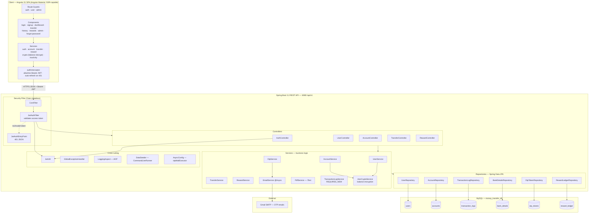
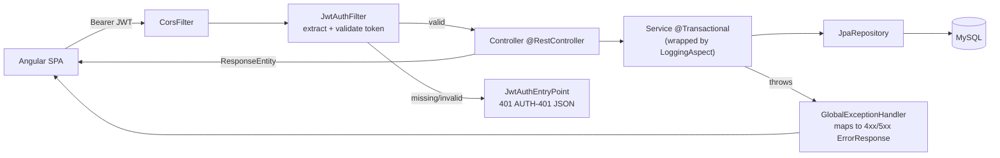

# Money Transfer System — Architecture Diagram (branch `g_c`)

> Reflects only what is implemented on branch **`g_c`**: 2-factor OTP auth (login
> step 2 is password-less), JWT access + refresh tokens, AES-encrypted balances,
> points rewards with cashback redemption, PDF statements, and async OTP email.
>
> Render: VS Code "Markdown Preview Mermaid Support", GitHub, or
> <https://mermaid.live> (paste a block to export PNG/SVG for slides).

---

## 1. System Architecture (layered / component view)

---

## 2. Request pipeline (how one authenticated call is handled)

---

### Key cross-cutting facts (branch `g_c`)

| Concern | Implementation |
| --- | --- |
| Auth | 2FA: password (login step 1) + email OTP (step 2). Step 2 is **password-less**. |
| Tokens | JWT access (10 min) + refresh (7 days); client auto-refreshes on 401. |
| Balance privacy | `AesCryptoService` encrypts user balances; Angular `CryptoService` decrypts on reveal (admin views stay plaintext). |
| Resilience | Failed transfers logged in a separate `REQUIRES_NEW` tx; reward failures never fail a transfer. |
| Rewards | Points per ₹100 (weekend 2×); redeem ≥500 pts as cash from a corporate CASHBACK account. |
| Seeding | `DataSeeder` seeds admin, sample `bank_details`, and the CASHBACK account at startup. |
