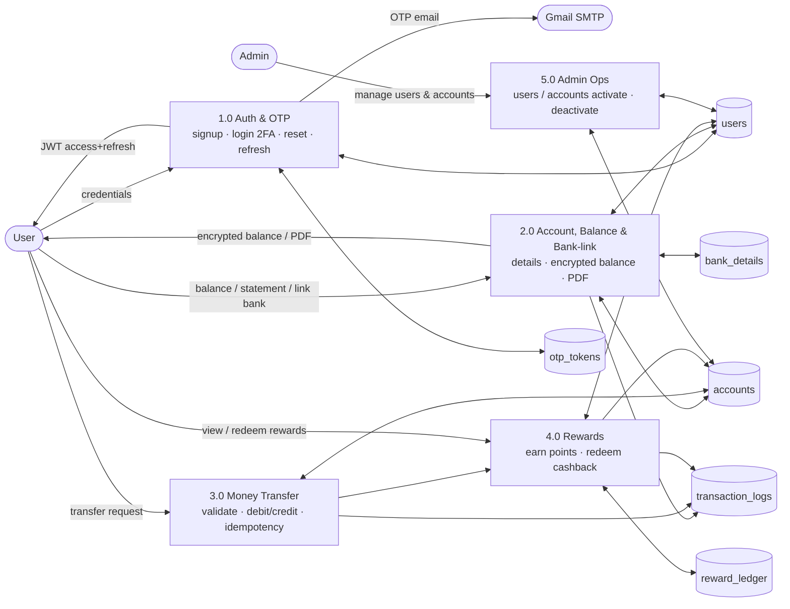
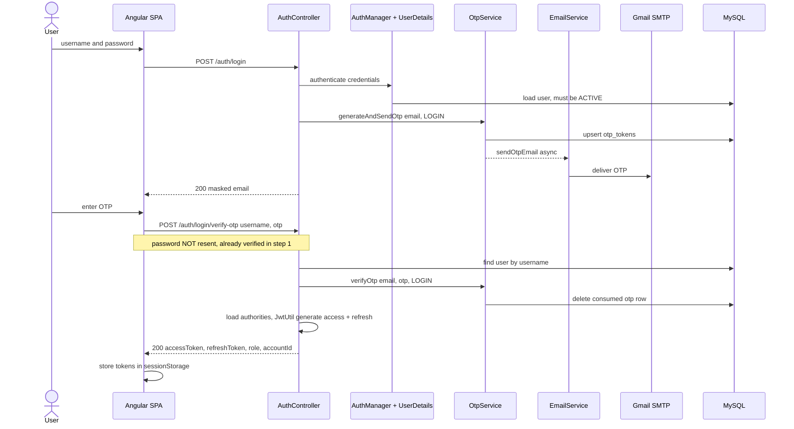
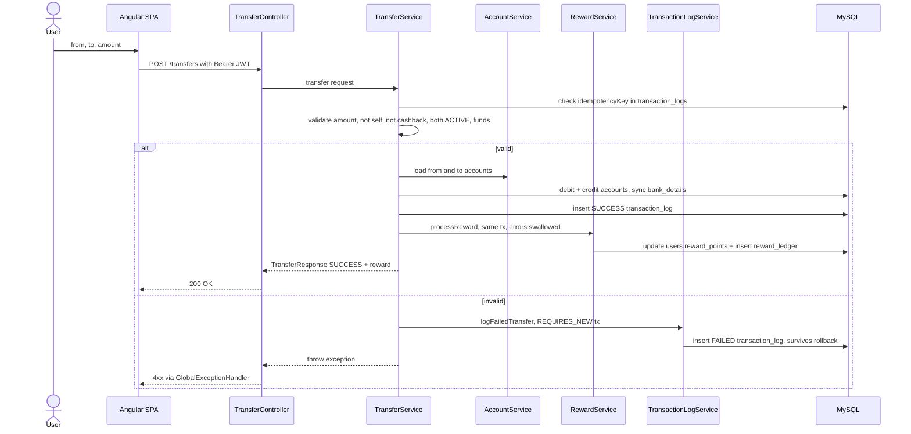
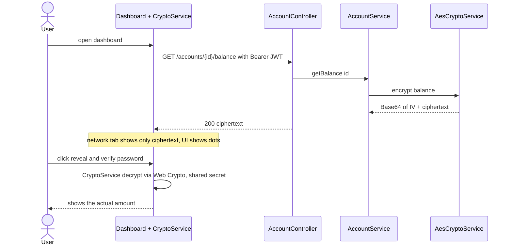
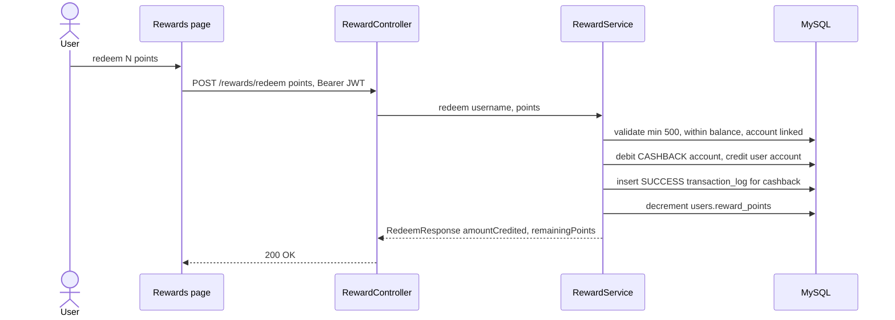

# Money Transfer System — Data Flow Diagram (branch `g_c`)

> Reflects only the `g_c` implementation. Render with VS Code Mermaid preview,
> GitHub, or <https://mermaid.live> (export PNG/SVG for slides).
> Pre-rendered PNGs are in [`docs/diagrams/`](./diagrams/).

---

## 1. Level-1 Data Flow Diagram (processes ↔ stores ↔ entities)

---

## 2. Login (2-factor) + token flow

---

## 3. Money transfer (validation, idempotency, rewards, failure logging)

---

## 4. Balance privacy — AES encryption end-to-end

---

## 5. Rewards redemption (points → cash)

